```{r setup, echo=F, warning=F}
knitr::opts_chunk$set(echo = FALSE)
knitr::opts_chunk$set(warning = FALSE)
library(dplyr)
library(knitr)
library(DT)
library(xtable)
```

## Flujo para el análisis de secuencias NGS de _E. coli_ 

### Descargar secuencias de _E. coli_

Una vez que la secuenciación finalizó, los datos (las secuencias crudas), se guardan en el repositorio del *Basespace Sequence Hub* -el entorno remoto de Illumina- donde se almacenan y analizan los datos obtenidos de la secuenciación de cualquier secuenciador de Illumina. Accederemos a las lecturas a través del navegador: [Basespace](https://login.illumina.com/platform-services-manager/?rURL=https://basespace.illumina.com&clientId=basespace&clientVars=aHR0cHM6Ly9iYXNlc3BhY2UuaWxsdW1pbmEuY29tL3NhbXBsZS8zODQ0NTcwNi9MTi1JTkMtRUJOMzY&redirectMethod=GET#/). Veremos lo siguiente:

<center>
<div style="width:50%; height:10%">
 
</div>
</center>

donde será necesario iniciar sesión. Una vez iniciada la sesión veremos la página de inicio del Sequence Hub, justo como se muestra a continuación:

<center>
<div style="width:100%; height:50%">
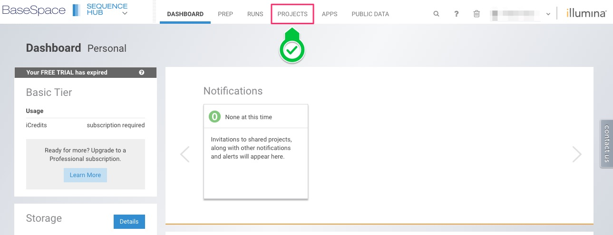 
</div>
</center>

Aquí accederemos a los proyectos, dando click sobre la p¡estaña de Projects, que esta marcada con el recuadro rojo en la imagen de arriba.
Aquí accederemos a los proyectos, dando click sobre la pestaña de Projects, que esta marcada con el recuadro rojo en la imagen de arriba.
A continuación mostramos la página de proyectos:

<center>
<div style="width:100%; height:100%">
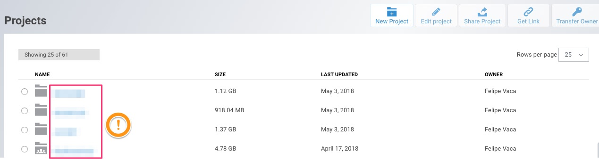 
</div>
</center>

Del lado derecho (marcado con el recuadro rojo) se encuentran el nombre de cada proyecto, daremos click sobre el nombre de nuestro proyecto. Se desplegara la siguiente página, donde daremos click sobre la pestaña de **Sample** (que se señala en el recuadro rojo)

<center>
<div style="width:100%; height:100%”>
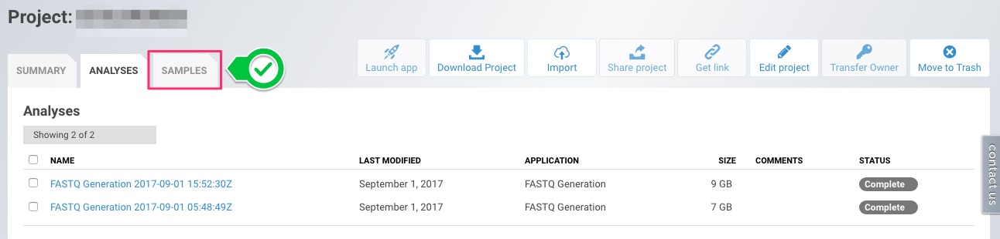 
</div>
</center>

A continuación se abrirá una página, como la que mostramos continuación, desde donde seleccionaremos nuestra muestra (como se muestra en el recuadro rojo)

<center>
<div style="width:100%; height:100%”>
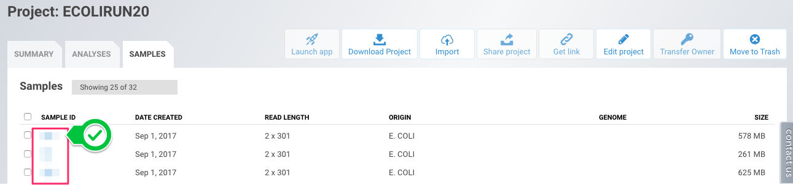 
</div>
</center>

La muestras seleccionadas se muestran en la página desplegada, con los detalles de la muestra, y en la parte inferior a la derecha (marcada con el recuadro rojo) aparecen dos archivos _fastq.gz_, estas son las lecturas crudas de nuestras muestras obtenidas de la secuenciación, por ser una secuenciación pareada tenemos dos archivos **R1** y **R2**. Seleccionaremos la casilla a la derecha del archivo (como se muestra en la imagen) y daremos click en **Download Selected** para descargar los datos.

<center>
<div style="width:100%; height:100%”>
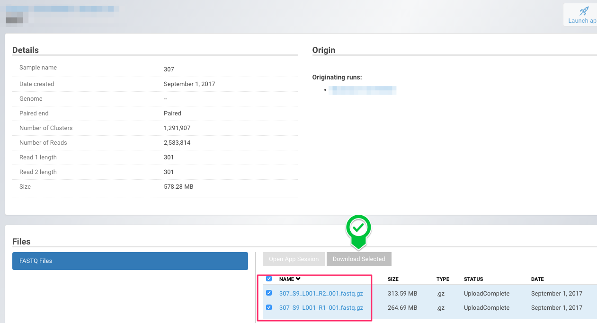 
</div>
</center>

Se desplegará una ventana como la que se muestra en la siguiente imagen y daremos click en “Download” para iniciar la descarga de los archivos.

<center>
<div style="width:100%; height:100%”>
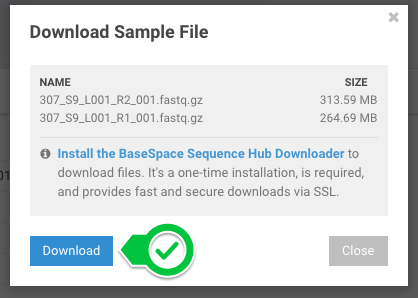 
</div>
</center>

Daremos click en el botón “Start Download” de la ventana que se acaba de desplegar -como se muestra en la imagen- y la descarga comenzará.

<center>
<div style="width:100%; height:100%”>
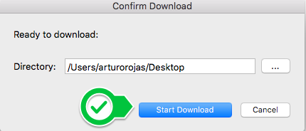 
</div>
</center>

<center>
<div style="width:100%; height:100%”>
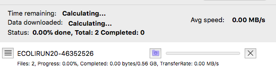 
</div>
</center>

Concluida la descarga procederemos al análisis de las secuencias crudas.

### Examinar la calidad de las secuencias crudas *FastQC*

Los secuenciadores modernos pueden generar decenas de millones de secuencias en una sola corrida. Antes de analizar estas secuencias para extraer conclusiones biológicas, siempre se debe realizar algunas comprobaciones del control de la calidad para garantizar que los datos crudos estén bien y no haya problemas o sesgos en los datos, el cual podría afectar la forma en que puede ser utilizado de manera útil. El archivo fastq contiene las bases llamadas y la calidad de dichas bases, de todas aquellas que pasaron filtro. Si abriéramos un archivo fastq veríamos lo siguiente:

```{bash}
cat /Users/arturorojas/Desktop/Ecoli/ECOLIRUN20-46352526/307-56019975/ejemplo.txt
```

Cada línea comienza con “@“ que permite identificar el comienzo de una secuencia, precediendo al símbolo se encuentran los siguiente valores separados con “:” donde cada uno tiene el siguiente significado: 

@\<instrumento\>\<número de corrida del instrumento\>:\<ID de la flow cell\>:\<número de la línea\>:\<coordenada X\>:\<coordenada Y\>:\<lectura\>:\<Filtrada\>:\<Número de control\>:\<Index\>

Después se encuentra la secuencia de nucleótidos representado por la inicial de cada uno (A, T, C, G) y una N para las bases no reconocidas por su baja calidad. El signo de “+”, que precede a las secuencias, es para referencias el mismo identificador y no repetirlo en una segunda ocasión. Por último en símbolos derivados del código ASCII se encuentra la calificación Phred, de cada una de las bases llamadas. La calificación expresa la probabilidad de que la base hubiese sido llamada de manera errónea, es decir es la certeza de cada base. La calificación va de 0 a 40 donde una calificación de 10, 20, 30 y 40 expresa una precisión de la base llamada del 90%, 99%, 99.9%, y 99.99% respectivamente.

Como mencionabamos antes, un archivo promedio puede contener millones de lecturas, en el caso específico del archivo que estamos ocupando como ejemplo tiene un total de 5,167,628 lecturas, por lo mismo para el análisis de la calidad en las lecturas crudas será necesario graficar la calidad de cada uno de los nucleótidos en cada lectura. Para esta tarea nos apoyaremos en el programa **FastQC**, que entrega -de manera sencilla- en gráficas de cajas y bigotes el comportamiento de la calidad de las lecturas, como se muestra en la siguiente imagen, donde podemos observar que el promedio de las lecturas tiene una calidad por arriba de 38, es decir más del 99% de certeza en cada base secuenciada.

<center>
<div style="width:100%; height:100%”>
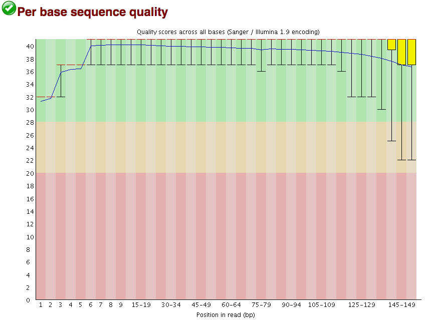 
</div>
</center>

El uso de esta herramienta es muy sencilla, hemos instalado el programa, solo tendrán que abrir el programa y seleccionar “File>Open”, seleccionar el archivo a analizar y el programa se encargara del resto. 

<center>
<div style="width:100%; height:100%”>
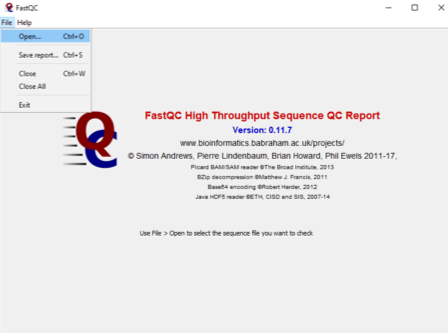 
</div>
</center>

Además de la gráfica ya mostrada, FastQc entrega FastQC 9 módulos de análisis y los desglosamos a continuación:


La estadística básica genera una estadística simple para el archivo analizado, en donde se reportan siete parámetros: Nombre del archivo, tipo de archivo, la codificación del archivo, total de la secuencia, secuencias filtradas, longitud de la secuencia y el porcentaje de GC.

<center>
<div style="width:50%; height:50%”>
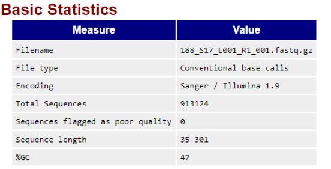 
</div>
</center>


El puntaje de calidad por secuencia reporta si un subconjunto de tus secuencias tienen valores de calidad bajas.

<center>
<div style="width:50%; height:50%”>
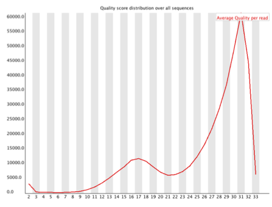 
</div>
</center>

La gráfica de contenido de secuencias por base nos muestra la proporción de cada posición de la base en un archivo de las cuatro bases de DNA que han sido llamada.

<center>
<div style="width:50%; height:50%”>
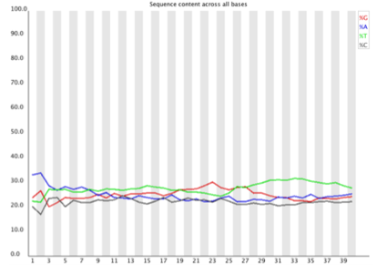 
</div>
</center>

La gráfica de contenido de GC nos indica el contenido de GC de cada posición de la base en el archivo.

<center>
<div style="width:50%; height:50%”>
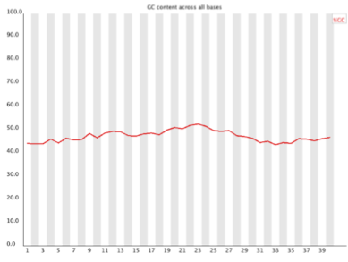 
</div>
</center>

Esta medida modula el contenido de GC entre la longitud completa de cada secuencia en un archivo y compara con una distribución normal modelado de contenido de GC.

<center>
<div style="width:50%; height:50%”>
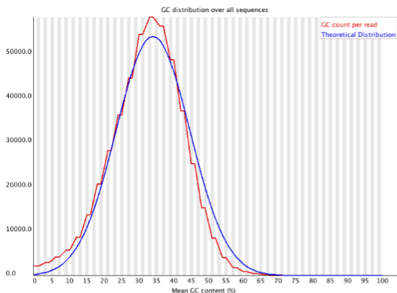 
</div>
</center>

Si un secuenciador es incapaz de realizar un llamado de basas suficientemente confiable entonces esto podría sustituir con N.

<center>
<div style="width:50%; height:50%”>
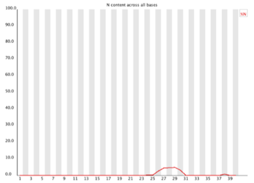 
</div>
</center>

Este módulo genera una gráfica que nos muestra la distribución del tamaño de los fragmentos en el archivo de los cuales fueron analizados.

<center>
<div style="width:50%; height:50%”>
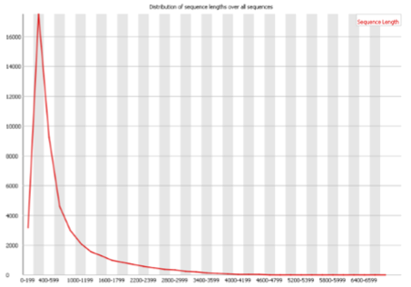 
</div>
</center>

Este módulo cuenta el grado de duplicación de cada secuencia y crea un gráfico que muestra el número relativo de secuencias con diferentes grados de duplicación.

<center>
<div style="width:50%; height:50%”>
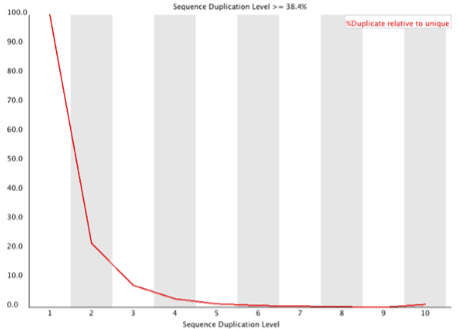 
</div>
</center>

Una biblioteca normal de alto rendimiento contendrá un conjunto diverso de secuencias, sin que una secuencia individual constituya una pequeña fracción del total. Encontrar que una sola secuencia está muy sobrerrepresentada en el conjunto significa que es altamente biológicamente significativa o indica que la biblioteca está contaminada o no es tan diversa como usted esperaba.

<center>
<div style="width:50%; height:50%”>
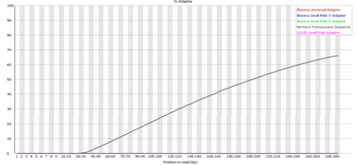 
</div>
</center>

### Análisis Integrado (Bacterial Analysis Pipeline CGE)

Una vez que sabemos que las lecturas obtenidas de la secuenciación es de calidad optima, podemos iniciar el análisis de las mismas. Seguiremos el [flujo de análisis bacteriano (BAP -Bacterium Analysis Pipeline-) del Center for Genomic Epidemiology](https://cge.cbs.dtu.dk/services/CGEpipeline-1.1/), que consiste en siete pasos, comenzando con 1) el ensamble y 2) un algoritmo de identificación de especies basado en k-mer. Con los contigs obtenidos a partir del ensamblaje se realiza un 3) análisis de los mismos y 4) la identificación de genes adquiridos de resistencia a antimicrobianos (ResFinder). Por último ejecuta el análisis de 5) tipificación multilocus de secuencias (MLST -multilocus sequence typing-), 6) identificación de plasmados e 7) identificación de virulencia.

<center>
<div style="width:50%; height:50%”>
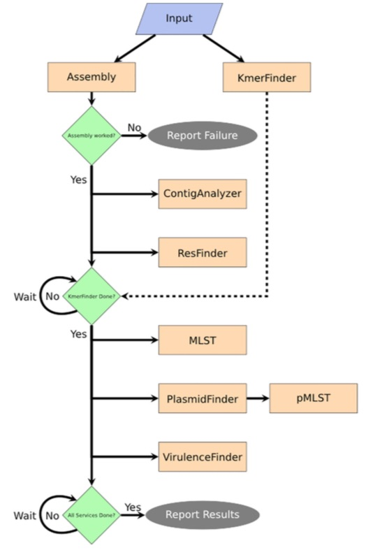 
</div>
</center>

A continuación explicaremos de manera el fundamento de cada uno de los pasos y por último daremos las instrucciones para el uso del BEP.

#### Instrucciones 

Primero es necesario que creemos un usuario para trabajar sobre la [plataforma](https://cge.cbs.dtu.dk/services/CGEpipeline-1.1/). En la página de inicio, en la esquina superior derecha, se encuentra un cuadro para acceder, daremos click en la opción “New” como se muestra en la siguiente imagen:

<center>
<div style="width:50%; height:50%”>
 
</div>
</center>

El registro es muy sencillo, sólo hay que escribir un nombre de usuario, correo electrónico y password. La plataforma enviará una liga al correo electrónico para activar la cuenta, por lo que será necesario acceder a tu correo donde darás click a la liga como lo pide el correo. 

<center>
<div style="width:50%; height:50%”>
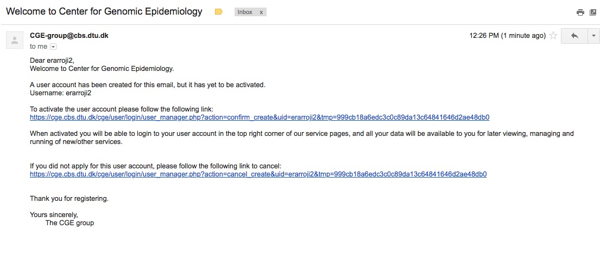 
</div>
</center>

La liga te dirigirá a una página nueva con el siguiente mensaje.

<center>
<div style="width:50%; height:50%”>
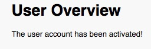 
</div>
</center>

Así tu cuenta habrá quedado activada y podremos empezar a trabajar. La página de [inicio](https://cge.cbs.dtu.dk/services/CGEpipeline-1.1/) para iniciar con el flujo de trabajo de ve como acontinuación

<center>
<div style="width:50%; height:50%”>
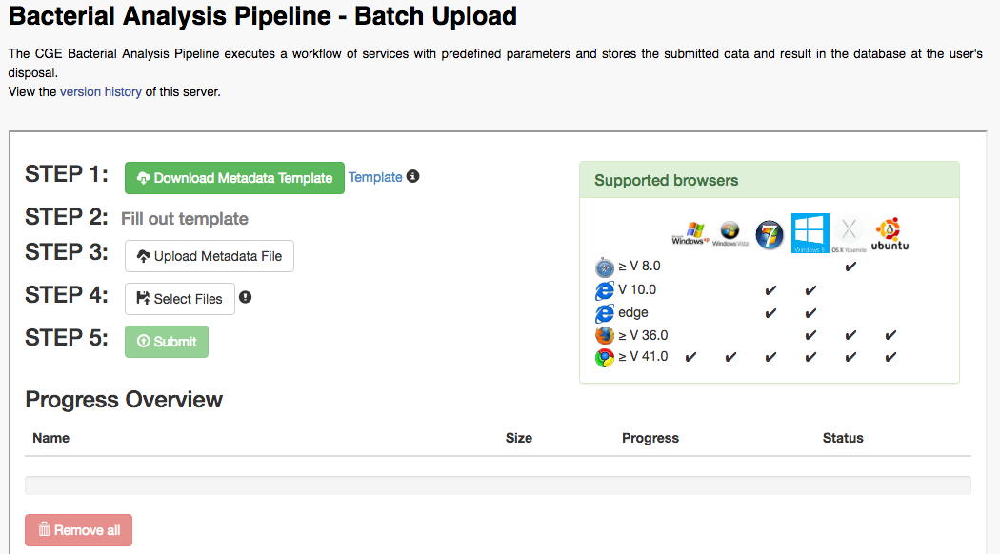 
</div>
</center>

Como puede observar la plataforma solista dos archivos de importancia: 1) el archivo de la metadata, y 2) los archivos a analizar.

1. La metadata consiste de un documento en excel que contiene los datos de los archivos a analizar. De los datos que conforman este documento es necesario llenar lo siguientes: 

```{r}
metadatos<-cbind(c("sample_name","file_names","pre_assembled","sequencing_platform","sequencing_type","organism","country","isolation_source","collection_date"), c("Nombre", "R1.Fq R2.Fq", "no", "Illumina", "paired", "e coli", "mexico", "fecha"))
kable(metadatos)
```

Es importante que todos los datos se llenen en minúsculas y sin acento.

2. Una vez lleno sube las lecturas crudas en el paso 4 y cuando estén cargados estarás listo para enviar el proceso dando click sobre la opción “Submit”.

Cuando el trabajo haya terminado, con el cursor sobre el nombre de usuario se desplegara un menú donde seleccionaremos “Sample Manager”, aquí encontraremos los análisis realizados a nuestra muestra, detallaremos cada uno de ellos en el siguiente apartado.

<center>
<div style="width:50%; height:50%”>
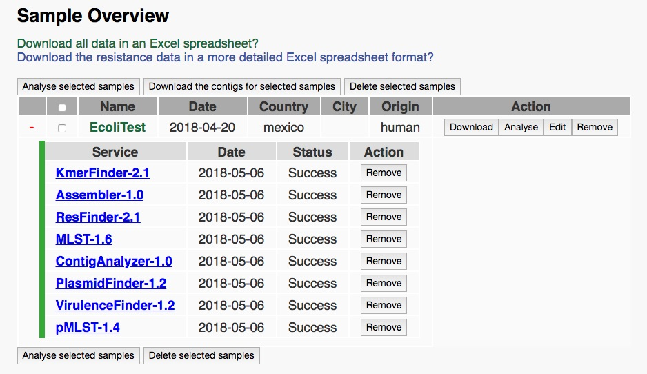 
</div>
</center>

#### Identificación de especie por K-mer

El método de K-mer finder está basado en el  número de k-mer (que son todas las posibles series de subsecuencias de un tamaño “k” contenidos en una secuencia) que se sobreponen entre el genoma analizado y los genomas en la base de referencia. Para este algoritmo el tamaño del k-mer es de 16, pues ha probado ser el método con mayor eficiencia.

<center>
<div style="width:50%; height:50%”>
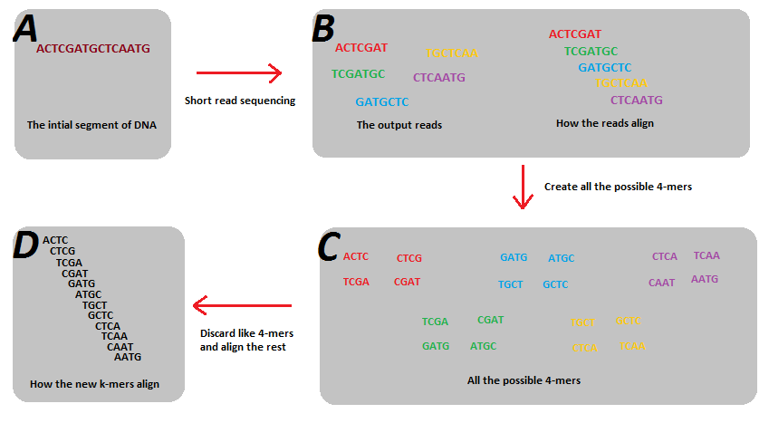 
</div>
</center>


#### Ensamblaje

El ensamblaje de novo consiste en unir las secuencias que se sobreponen y hacer una a partir de estas secuencias contiguas , llamadas “contigs”, sin el uso de una secuencia de referencia. La mayoría de los algoritmos de alineamiento se basan en grafos de Brujin. El ensamblaje de novo crea secuencias contiguas sin espacios a partir de las secuencias de ADN y cuando hay secuencias pareadas disponibles son utilizadas para combinar los contigs en andamios. 

<center>
<div style="width:50%; height:50%”>
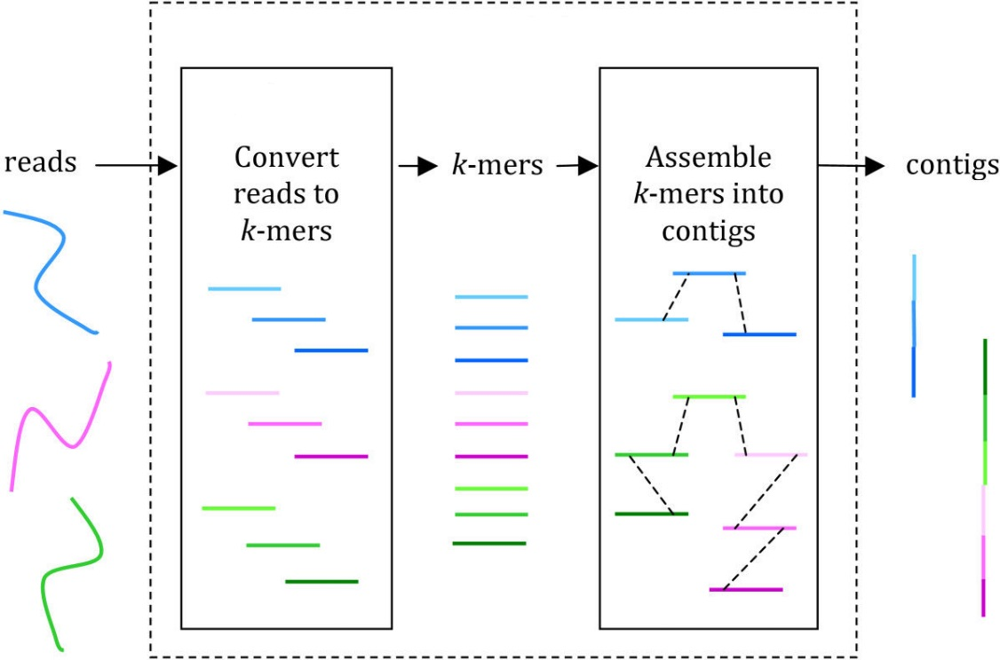 
</div>
</center>

#### Análisis de Contig

El análisis de contigs nos permite verificar la calidad del ensamble. Consiste en valores de estadística descriptiva de los tamaños de los contigs que componen en ensamble. Entre ellos encontramos el número total de contigs, el número de bases su mediana y su media y el valor N50. El valor de N50 define la calidad del ensamble en términos de contigüidad. El N50 se define como la secuencia más corta en tamaño en el 50% del genoma. 

<center>
<div style="width:50%; height:50%”>
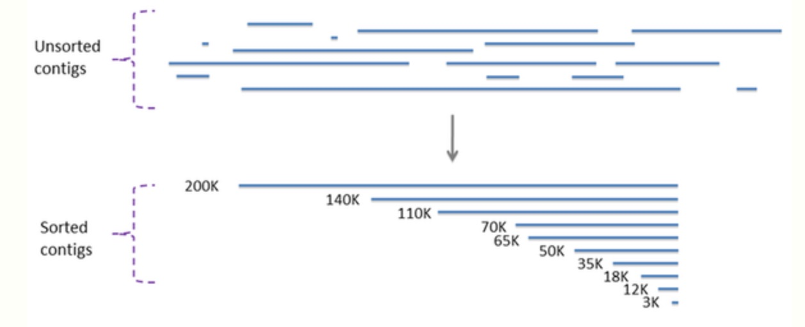 
</div>
</center>

#### Multilocus sequence typing service (MLST)

Es una técnica de tipificación que identifica las secuencias, de nucleótidos internas de aproximadamente 400 a 500 pb, en múltiples genes hosuekeeping. Las secuencias para cada uno de los locus son comparadas con las secuencias existentes, si las secuencias son diferentes, se consideran nuevas secuencias y se les asigna un número de alelo único. A continuación se muestra una representación donde se han estudiado siete locus en tres cepas distintas, las diferencias entre los locus genera un perfil alelico para cada una de ellas.

<center>
<div style="width:50%; height:50%”>
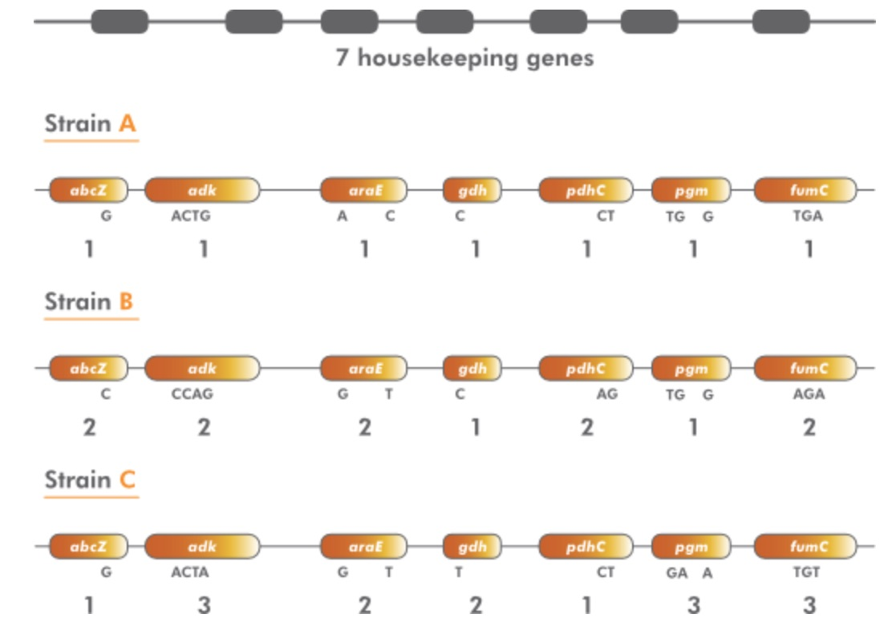 
</div>
</center>

#### Identificación de resistencia antimicrobiana, plasmidos y genes de virulencia

Por último la identificación para genes de resistencia, virulencia y plasmidos, lo realiza a través de un algoritmo semejante a un “blast”. A partir de una base de datos confronta los genes obtenidos e identifica aquellos vinculados con las propiedades buscadas.